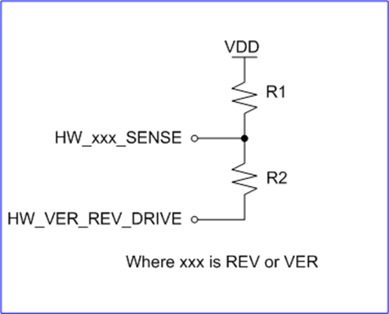

# DS-019 Pixhawk standard versions and revisions
## Background
With the introduction of the Pixhawk FMUv5x and FMUv6x standard, versioning of boards and ensuring intercompatibility has become both a major feature as well as a challenge. To comply with the standard, both software maintainers as well as hardware manufacturers must agree to follow the same guidelines. This page is the central place where versions and revisions of Pixhawk FMUs are tracked and managed.

There are two different things to be sensed:

1.  the revision of the FMU board itself. This is called the REVISION (REV).
2.  the version of the base board that carries the FMU. This is called the VERSION (VER).
    

The REV and VER are determined by an ADC which reads a voltage divider. The voltage divider for the VER is on the base board, while the REV is on the FMU.

## Resistor values
The mapping of the VER/REV number to actual ohmic resistor values for the voltage divider is defined in this section. The diagram shows R1 and R2, with the signals `HW_xxx_SENSE` and `HW_VER_REV_DRIVE`.

Config | R1 (K) | R2 (K)
-- | -- | --
0 | NO POP | NO POP
1 | 442 | 24.9
2 | 174 | 32.4
3 | 115 | 38.3
4 | 84.5 | 46.4
5 | 61.9 | 51.1
6 | 51.1 | 61.9
7 | 46.4 | 84.5
8 | 38.3 | 115
9 | 32.4 | 174
10 | 24.9 | 442

  | Expected limits | Boundary | Expected voltage | Boundary
-- | -- | -- | -- | --
ver/rev | range (DN) | thresholds (DN) | limits (V) | thresholds (V)
0 | 204 | 0 | 0.166 | 0
  | 553 | 579 | 0.441 | 0.467
1 | 605 | 580 | 0.492 | 0.468
  | 966 | 967 | 0.77 | 0.779
2 | 968 | 968 | 0.788 | 0.78
  | 1331 | 1356 | 1.062 | 1.093
3 | 1382 | 1357 | 1.125 | 1.094
  | 1738 | 1756 | 1.386 | 1.415
4 | 1774 | 1757 | 1.443 | 1.416
  | 2113 | 2137 | 1.685 | 1.722
5 | 2161 | 2138 | 1.759 | 1.723
  | 2476 | 2519 | 1.975 | 2.03
6 | 2562 | 2520 | 2.085 | 2.031
  | 2842 | 2919 | 2.267 | 2.353
7 | 2996 | 2920 | 2.438 | 2.354
  | 3230 | 3308 | 2.577 | 2.666
8 | 3386 | 3309 | 2.755 | 2.667
  | 3571 | 3699 | 2.848 | 2.981
9 | 3827 | 3700 | 3.114 | 2.982
  | 3946 | 4095 | 3.147 | 3.363

## EEPROM logic
The goal of the Pixhawk community is to make all base boards and FMUs compatible and interchangeable. Since all hardware manufacturers share this same narrow number space, an additional logic was added.

If the VER resistor encodes the value 0x007, this tells the FMU that it needs to access the EEPROM to poll the true version of the base board. This opens up the number space significantly.

The same logic applies to the REV resistor on the FMU - if it encodes the value 0x007, the true revision of the FMU shall be read from EEPROM.

## Addition of a new board
If a manufacturer wants to introduce a new board - either a base board version or an FMU revision - this desire shall be indicated to the PX4 board support team by issuing a PR to this repository with the respective additions to the [table below](#defined-versions-and-revisions).

## Defined versions and revisions

HWTYPE = {v5/6x}{VER}{REV}  

### Base board versions

|     |     |     |
| --- | --- | --- |
| **Value** | **Encoded by** | **Base board VERSION** |
| 0x000 | resistors | Auterion v5x base board |
| 0x001 | resistors | v5x base without px4io |
| 0x002 | resistors | Modal AI |
| 0x003 | resistors | NXP T1 PHY |
| 0x004 | resistors | HB CM4 |
| 0x005 | resistors | HB mini |
| 0x006 | resistors |     |
| 0x007 | resistors | Read Version from EEPROM |
| 0x008 | resistors | Skynode QS with USB |
| 0x009 | resistors | Auterion Skynode base RC9 & older (no usb) |
| 0x00a | resistors | Skynode QS no USB |
| 0x010 | EEPROM | Auterion Skynode RC10, RC11, RC12, RC13 |

### FMU v5x revisions

|     |     |     |
| --- | --- | --- |
| **Value** | **Encoded by** | **FMU v5x REVISION** |
| 0x000 | resistors | FMUv5x RC13 (baro2 on I2C4) |
| 0x001 | resistors | FMUv5x RC15 (baro2 on I2C2) |
| 0x002 | resistors | FMUv5x rev 2 sensor set |
| 0x003 | resistors | FMUv5x rev 3 sensor set |
| 0x004 | resistors |     |
| 0x005 | resistors |     |
| 0x006 | resistors |     |
| 0x007 | resistors | Read Revision from EEPROM |
| 0x009 | resistors |     |
| 0x00a | resistors |     |
| 0x010 | EEPROM |     |

### FMU v6x revisions

|     |     |     |
| --- | --- | --- |
| **Value** | **Encoded by** | **FMU v5x REVISION** |
| 0x000 | resistors |     |
| 0x001 | resistors | CUAV v6x |
| 0x002 | resistors |     |
| 0x003 | resistors | Holybro FMUv6x rev3 |
| 0x004 | resistors | Holybro FMUv6x rev4 |
| 0x005 | resistors |     |
| 0x006 | resistors |     |
| 0x007 | resistors | Read Revision from EEPROM |
| 0x009 | resistors |     |
| 0x00a | resistors |     |
| 0x010 | EEPROM | Auterion FMUv6x 0.6.0  |